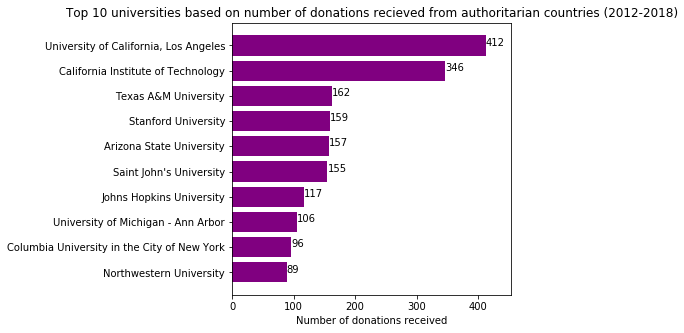
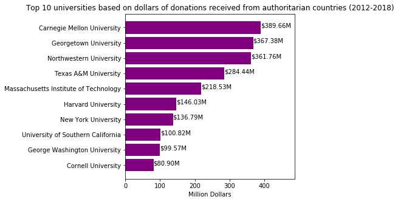

## Data compilation and analysis of foreign donations made to US universities between 2012-2018

### Motivation

Universities in the United States often receive private donations. The source of these donations can be from domestic sources, such as American companies or private citizens (including alums), or from foreign countries. In recent years, there are concern that foreign nations are contributing massive amount of donations to US universities, which may come with security concerns (e.g. espionage) and/or ethical concerns (e.g. research funding from nations with dubious human rights records). The US Department of Education requires university to self-report foreign donations annually. In this project, I am compiling these publicly available donation data and cross-correlating them with metric that measures human rights and democratic development of each country to see if there are any patterns that would emerge.

#### Related reporting:

* [NPR](https://www.npr.org/2020/02/13/805548681/harvard-yale-targets-of-education-department-probe-into-foreign-donations)
* [New York Times](https://www.nytimes.com/2019/08/30/us/politics/universities-foreign-donations.html)
* [Washington Post](https://www.washingtonpost.com/local/education/us-investigates-harvard-and-yale-over-foreign-revenue-sources/2020/02/12/b68fcb2a-4dda-11ea-b721-9f4cdc90bc1c_story.html)

### Data Source

Foreign donations to universities in the US are self reported to the Federal Department of Education each here. Currently, data from 2012-2018 is available.

* [Foreign Donation Data](https://catalog.data.gov/dataset/foreign-gifts-and-contracts-report-2011)

There are many available metrics that measures a country's democracy development and human rights status. The one chosen here is the [Democracy Index](https://en.wikipedia.org/wiki/Democracy_Index) developed by the [Economist Intelligence Unit](https://www.eiu.com/topic/democracy-index) (the research and analysis division of [The Economist Group](https://www.economistgroup.com/)). The Democracy Index is updated each year. Detailed measurement methodology are available on the accompanied white paper published by The Economist, which is [freely available](https://www.eiu.com/public/topical_report.aspx?campaignid=democracyindex2019). A copy is uploaded to the repository.

* [2019 Democracy Index White Paper](https://github.com/thewchan/US-HigherEd_Foreign_Donations/blob/master/Democracy-Index-2019.pdf)

### Sample Processed Data

The project is on-going, and the current progress can be perused from the Jupyter Notebook on the repository.

* [Link to Jupyter Notebook](https://github.com/thewchan/US-HigherEd_Foreign_Donations/blob/master/foreign_donations.ipynb)

Below are some sample output graphs from data compilation.

